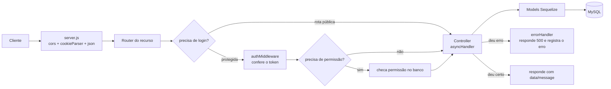

# Arquitetura — Backend

> 📘 **Para quem é:** quem vai mexer no código do backend.
> **O que você vai entender:** como o projeto é organizado, o caminho que um pedido faz até virar resposta, como funciona login/permissões, como os dados se relacionam e como adicionar coisas novas.
> **Pré-requisitos:** noções básicas de JavaScript. Termos técnicos estão no [GLOSSARIO.md](./GLOSSARIO.md) — não decore, consulte quando precisar.

## A ideia em uma frase
Este backend é uma **API** (ver glossário): um programa que fica ligado recebendo pedidos do site/app e respondendo com dados, guardados num banco MySQL.

## Analogia: um restaurante 🍽️
Para entender as "camadas" do código, imagine um restaurante:

| No restaurante | No código | O que faz |
|---|---|---|
| Garçom que anota o pedido | **Rota** (`routes/`) | Recebe a requisição em um endereço (ex.: `POST /tournaments`) |
| Segurança na porta | **Middleware** (`middleware/`) | Confere antes de deixar passar (ex.: "você está logado?") |
| Cozinheiro | **Controller** (`controllers/`) | Faz o trabalho: valida, decide, monta a resposta |
| Despensa organizada | **Model / Sequelize** (`database/models/`) | Forma de pegar/guardar dados sem escrever SQL na mão |
| Estoque | **MySQL** | O banco de dados onde tudo fica guardado de verdade |
| Receitas reutilizáveis | **Services** (`services/`) | Lógica usada por vários cozinheiros |

## Estrutura de pastas (`src/`)
Cada pasta tem um papel; abaixo o que procurar em cada uma:

| Pasta | O que tem |
|---|---|
| `server.js` | O "liga" do projeto: configura tudo e registra as rotas. |
| `routes/` | Os endereços (endpoints) de cada recurso e quais "seguranças" (middlewares) cada um usa. |
| `controllers/` | A lógica de cada endereço. |
| `middleware/` | Os "seguranças": `auth` (confere token), `requirePermission` (confere permissão), `asyncHandler` e `errorHandler` (tratam erros). |
| `services/` | Funções reaproveitadas: `canManageTournament` (quem pode mexer no campeonato) e `deleteTournamentCascade` (apagar em cascata). |
| `lib/` | Clientes de serviços externos: `supabase.js` (cliente admin do Supabase Storage para upload de escudos). |
| `constants/` | Valores fixos: `permissions.js` (lista de permissões) e `enums.js` (valores válidos de status/tipo). |
| `database/models/` | Os "moldes" das tabelas e como elas se relacionam. |
| `database/migrations/` | Histórico de mudanças na estrutura do banco. |
| `database/seeders/` | Dados iniciais (ex.: o admin dono do sistema). |
| `database/config/config.js` | Dados de conexão com o banco (lê o `.env`). |

## O caminho de um pedido (ciclo de requisição)
Todo pedido passa por uma "linha de montagem". Veja o diagrama e, logo abaixo, a explicação em palavras.



**Em palavras:** o pedido chega no `server.js`, que primeiro aplica configurações gerais (liberar o frontend via CORS, ler cookies, entender JSON). Depois ele vai para a **rota** certa. Se a rota é protegida, o **segurança** (`authMiddleware`) confere o token; se a ação exige permissão, isso também é checado **consultando o banco**. Passando pelos seguranças, o **controller** faz o trabalho e usa os **models** para ler/gravar no MySQL. Se algo dá errado de forma inesperada, o `errorHandler` central responde com erro 500 — o controller não precisa tratar isso sozinho.

> 💡 **Por que `asyncHandler` e `errorHandler`?** Sem eles, cada função precisaria de um `try/catch` repetido para não derrubar o servidor. O `asyncHandler` "embrulha" cada controller e manda qualquer erro inesperado para o `errorHandler`, que responde de forma padronizada. Menos repetição, comportamento consistente.

## Login e permissões (autenticação + autorização)

### Os dois tokens (resumo)
- **Access token**: o "crachá" do dia a dia (dura 5h), enviado em todo pedido privado no cabeçalho `Authorization: Bearer <token>`.
- **Refresh token**: um "cartão de sócio" (dura 7 dias) guardado num **cookie httpOnly**, usado só para gerar um novo access token quando ele expira (com rotação a cada uso).
- Explicação completa e didática em [`../AUTH_DOCS.md`](../AUTH_DOCS.md).

### Quem é quem (papéis)
- **`user`** = organizador: dono dos próprios campeonatos e times.
- **`admin`** = equipe do sistema, com **permissões** específicas.
- **`isSuperAdmin`** = o dono do sistema: tem todas as permissões e ninguém além dele mesmo pode alterá-lo.

### As 4 permissões de admin (`constants/permissions.js`)
| Permissão | Deixa o admin... |
|---|---|
| `manage_organizers` | editar/desativar/excluir organizadores |
| `manage_tournaments` | editar/excluir campeonatos de terceiros |
| `manage_admins` | criar admins e definir permissões |
| `view_all` | ver (ler) todas as contas e campeonatos |

### Como o código decide se pode
- **`userCan(user, permissão)`**: responde "esse usuário tem essa permissão?". O super-admin sempre pode; conta desativada nunca pode.
- **`canManageTournament(req, tournament)`**: "essa pessoa pode mexer neste campeonato?". O **dono** sempre pode; outros só com `manage_tournaments`. Importante: ele **consulta o banco**, não confia no que vem no token.

> ⚠️ **Regra de ouro:** ao proteger algo que pertence a um campeonato (fase, grupo, partida), use `canManageTournament` com o campeonato dono daquele item. **Nunca** decida permissão olhando só o `req.userRole` do token — isso já causou uma falha de segurança no passado.

## Como os dados se relacionam (modelo de dados)
Cada caixa é uma tabela; as linhas mostram quem se liga a quem.

```mermaid
erDiagram
    User ||--o{ Tournament : "possui (userId)"
    User ||--o{ Team : "possui (userId)"
    Tournament ||--o{ Phase : "tem"
    Tournament }o--o{ Team : "via TournamentTeam"
    Phase ||--o{ Group : "tem"
    Phase ||--o{ Match : "tem"
    Group ||--o{ Match : "tem"
    Group ||--o{ TournamentTeam : "agrupa (members)"
    Team ||--o{ Match : "home/away"
    Tournament }o--|| Team : "champion/runnerUp/thirdPlace/..."

    User { int id; string name; string email; string password; string refreshToken; string role; json permissions; bool isActive; bool isSuperAdmin }
    Tournament { int id; string name; text description; string logoUrl; int userId; string organizerName; enum status; int championId; int runnerUpId; int thirdPlaceId; json awards }
    Team { int id; string name; string logoUrl; int userId }
    Phase { int id; string name; enum type; int order; int tournamentId }
    Group { int id; string name; int phaseId }
    Match { int id; int homeScore; int awayScore; enum status; enum leg; date matchDate; int phaseId; int groupId; int homeTeamId; int awayTeamId }
    TournamentTeam { int id; int tournamentId; int teamId; int groupId }
```

**Em palavras:**
- Um **usuário** (organizador) tem vários **campeonatos** e vários **times**.
- Um **campeonato** tem várias **fases**; cada fase pode ter **grupos** (em pontos corridos) e **partidas**.
- Um **time** participa de vários campeonatos e um campeonato tem vários times — essa relação "muitos-para-muitos" passa pela **tabela pivô** `TournamentTeam`, que também guarda em qual grupo o time joga.
- Uma **partida** liga dois times (casa e visitante) dentro de uma fase/grupo.
- O campeonato também aponta para os times do **pódio** e das premiações.

> 💡 **Cascata:** apagar um campeonato apaga, em ordem segura e dentro de uma transação, suas partidas → grupos → vínculos de times → fases. Isso vive em `services/deleteTournamentCascade.js` e evita deixar "dados órfãos".

## Convenções (combinados do projeto)
Seguir esses combinados mantém o código consistente:
- **Controllers:** cada função é `nome: asyncHandler(async (req, res) => { ... })`. Erros de validação respondem com `res.status(4xx).json({ error })`; **não** use `try/catch` para erro inesperado (o `errorHandler` cuida).
- **Valores fixos:** valide sempre usando `constants/enums.js` (`PHASE_TYPES`, `MATCH_STATUSES`, `MATCH_LEGS`, `TOURNAMENT_STATUSES`) em vez de repetir listas no código.
- **Formato das respostas:** sucesso `{ data, message? }`, erro `{ error }`.
- **Endereços REST:** `POST /` (criar), `GET /` (listar), `GET /:id` (ler um), `PUT /:id` (atualizar), `DELETE /:id` (apagar). Exceções propositais: `/auth/*`, `POST /users/register`, `GET /users/permissions`.
- **Segurança:** senha sempre com `bcrypt`; nunca devolver `password`/`refreshToken` nas respostas.

### Códigos de status que usamos
`200` ok · `201` criado · `400` validação · `401` não logado · `403` sem permissão · `404` não existe · `409` conflito · `422` regra de negócio · `429` excedeu rate limit · `500` erro inesperado.

### Rate limiting (proteção contra abuso)
- Login: 10 tentativas falhas / 15 min por IP.
- Refresh: 60 / 15 min. Registro: 20 / 1 h.

## Passo a passo: adicionar um recurso novo
Exemplo mental: criar um recurso "Notícias".
1. **Model** em `database/models/` (campos + relações em `associate`).
2. **Migration** (`npx sequelize-cli migration:generate --name cria-noticias`) e rode `db:migrate`.
3. Se tiver valores fixos novos (status, tipos), adicione em `constants/enums.js`.
4. **Controller** em `controllers/`: funções com `asyncHandler`, validações 4xx, e checagem de permissão com `canManageTournament`/`userCan` quando fizer sentido.
5. **Rota** em `routes/` no padrão REST; coloque `authMiddleware`/`requirePermission` conforme o acesso.
6. **Registre** a rota no `server.js` (`app.use('/noticias', NoticiasRoutes)`), **antes** do `app.use(errorHandler)`.
7. **Atualize a documentação:** `API.md`, `openapi.yaml` e a coleção Postman.

## Variáveis de ambiente
Ficam no arquivo `.env` (config fora do código). Modelo comentado em [`../.env.example`](../.env.example). Resumo: `TZ`, `NODE_ENV`, `DB_*` (banco), `PORT`, `FRONTEND_URL` (CORS), e os segredos `JWT_SECRET`/`JWT_EXPIRES_IN`, `REFRESH_TOKEN_SECRET`/`REFRESH_TOKEN_EXPIRES_IN`.
